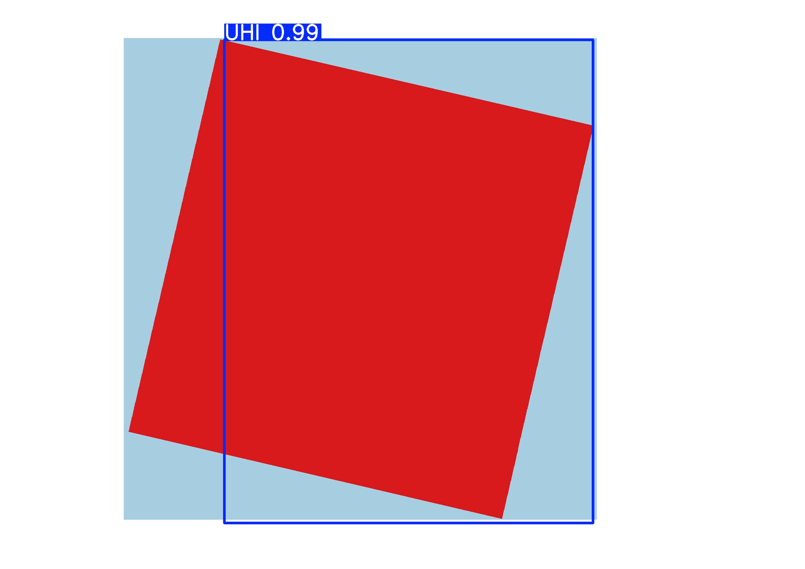

# Urban-Heat-Island-Detection
Remote Sensing-Based Urban Heat Island Detection using QGIS, thermal satellite data, and YOLOv8
# 🌆 Urban Heat Island Detection using YOLOv8 & QGIS

This project uses thermal satellite data, QGIS, and YOLOv8 deep learning to detect Urban Heat Islands (UHIs) from remote sensing imagery.

## 🔧 Tools Used
- QGIS
- YOLOv8
- LabelImg
- Python
- PowerBI 

## 🛰️ Steps:
1. Collected thermal satellite imagery (Landsat 8)
2. Processed LST (Land Surface Temperature) in QGIS
3. Labeled UHI zones using LabelImg
4. Trained YOLOv8 for object detection
5. Ran predictions to detect UHI regions

## 📸 Sample Output

---

## 📚 Resources
- [YOLOv8](https://docs.ultralytics.com)
- [QGIS](https://qgis.org)

